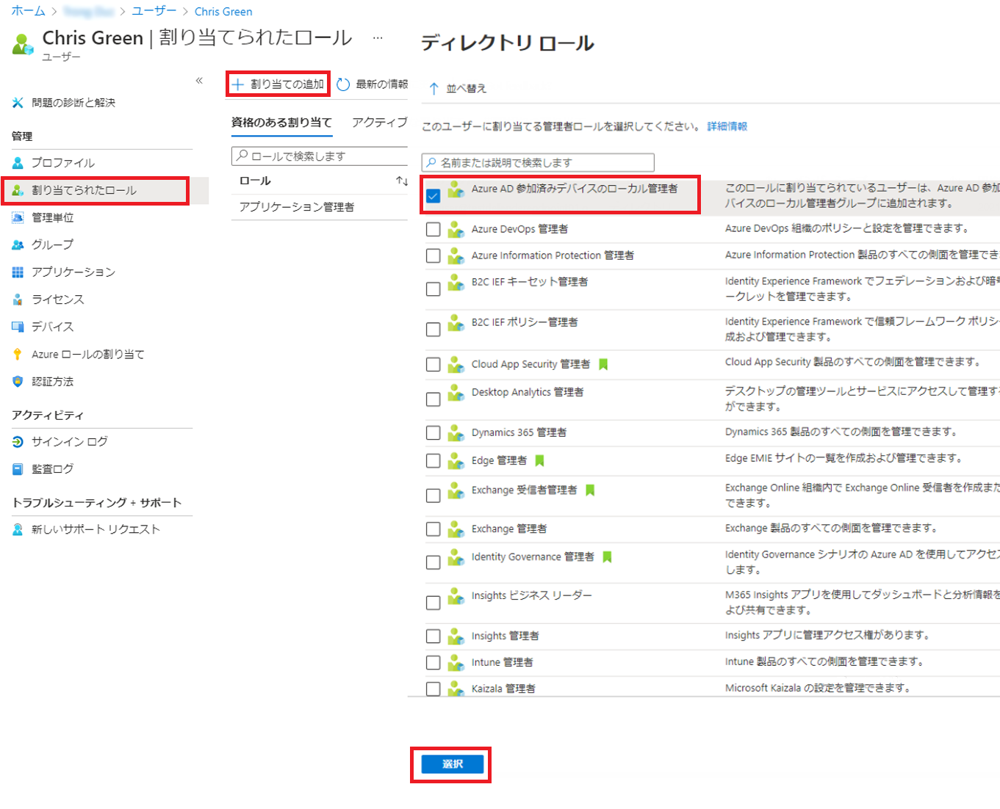

---
lab:
    title: '01 - ユーザー ロールを管理する'
    learning path: '01'
    module: 'モジュール 01 – ID 管理ソリューションを実装する'
---

# ラボ 01: ユーザー ロールを管理する

## ラボ シナリオ

あなたの会社では最近、アプリケーション管理者として業務を遂行する新しい従業員を採用しました。新しいユーザーを作成し、セキュリティ ロールを割り当てる必要があります。

#### 推定時間: 10 分

## 演習 1 - 新しいユーザーを作成し、アプリケーションの管理者権限をテストする

### タスク 1 - 新しいユーザーを追加する

1. [https://portal.azure.com](https://portal.azure.com) にグローバル管理者としてサインインします

2. **「Azure Active Directory」** を検索して選択します。

3. 左側のナビゲーション メニューの **「管理」** で、**「ユーザー」 > 「+ 新しいユーザー」** を選択します。

4. 「ユーザーの作成」が選択されていることを確認します。  次の情報を使用してユーザーを作成します。

    | **設定**| **値**|
    | :--- | :--- |
    | ユーザー名| ChrisG|
    | 名前| Chris Green|
    | 名| Chris|
    | 姓| Green|

5. 「**自分でパスワードを作成する**」をマークします

6. パスワード = **Pass@word1**

     *このアカウントに最初にログインするときにパスワードを変更する必要があります*

7. 「**作成**」を選択します。これでユーザーが作成され、組織に登録されました。

### タスク 2 - ログインしてアプリを作成する

1. 新しい InPrivate ブラウザー ウィンドウを開きます。
2. Chris Green として、Azure portal ([https://portal.azure.com](https://portal.azure.com)) を開きます。

    | **設定**| **値**|
    | :--- | :--- |
    | ユーザー名| ChrisG@`your domain name.com`|
    | パスワード| Pass@word1|

3. パスワードを更新します。

    | **設定**| **値**|
    | :--- | :--- |
    | 現在のパスワード| Pass@word1|
    | 新しいパスワード| Pa$$w.rd1234|
    | パスワードの確認| Pa$$w.rd1234|

4. 「**Microsoft Azure ツアーへようこそ**」ダイアログが表示された場合は、「**後で**」ボタンをクリックします。

5. 画面上部の検索ダイアログで「**エンタープライズ アプリケーション**」を検索して選択します。
6. 権限がないため「**+ 新しいアプリケーション**」は利用できないことに注意してください。
7. 「**アプリケーション プロキシ**」、「**ユーザー設定**」などの他の設定をクリックして、**Chris Green** に権限がないことを確認してください。
8. 右上隅にある **ChrisG** の名前をクリックして、サイン アウトします。

## 演習 2 - アプリケーション管理者のロールを割り当て、アプリを作成する

### タスク 1 - ユーザーにロールを割り当てる

Azure Active Directory (Azure AD) を使用して、特権が低いロールで ID のタスクを管理する限定された管理者を指定できます。ユーザーの追加または変更、管理ロールの割り当て、ユーザーのパスワードのリセット、ユーザーのライセンスの管理、ドメイン名の管理などの目的で管理者を割り当てることができます。

1. グローバル管理者のロールとしてまだログインしていない場合は、Azure portal を開いてログインします。
2. 「Azure Active Directory」ブレードに移動します。
3. メニューの「管理」セクションで「**ユーザー**」をクリックします。
4. **Chris Green** のアカウントをクリックします。
5. 「管理」セクションから「**割り当てられたロール**」を選択します。
6. 「**+ 割り当ての追加**」をクリックして、**アプリケーション管理者** のロールをマークします。
7. 「**追加**」をクリックします。

    

8. 「**更新**」ボタンをクリックします。

     ##### 新しく割り当てられたアプリケーション管理者ロールが、ユーザーの **「割り当てられたロール」** ページに表示されます。

### タスク 2 - アプリケーションのアクセス許可を確認する

1. 新しい InPrivate ブラウザー ウィンドウを開きます。
2. Chris Green として、Azure portal ([https://portal.azure.com](https://portal.azure.com)) を開きます。

    | **設定**| **値**|
    | :--- | :--- |
    | ユーザー名| ChrisG@`your domain name.com`|
    | パスワード| Pa$$w.rd1234|

3. 「**Microsoft Azure ツアーへようこそ**」ダイアログが表示された場合は、「**後で**」ボタンをクリックします。
4. 画面上部の検索ダイアログで「**エンタープライズ アプリケーション**」を検索して選択します。
5. 「**+ 新しいアプリケーション**」が利用可能になったことに注意してください。
6. 「**+ 新しいアプリケーション**」をクリックします

     ##### このロールには、テナントにアプリケーションを追加する権限があります。  この権限については、後のラボでさらに実験します。

7. Azure portal の Chris Green のインスタンスからサインアウトし、ブラウザーを閉じます。

## 演習 3 - ロールの割り当てを削除する

### タスク 1 - Chris Green からアプリケーション管理者を削除する

このタスクでは、別の方法を使用して、割り当てられたロールを削除します。 Azure AD の「**ロールと管理者**」オプションを使用します。

1. グローバル管理者としてまだログインしていない場合は、Azure portal を起動して今すぐログインしてください。
2. 検索ボックスに「**Azure Active Directory**」と入力し、Azure AD を起動します。
3. **Azure Active Directory** で、「**ロールと管理者**」を選択し、一覧から **アプリケーション管理者** のロール選択します。

     ##### この時点で複数のロールを選択して、いくつかの一括アクティビティを実行できることに注意してください。

4. 「**アプリケーション管理者**」の **割り当て**ページに、Chris Green の名前が表示されます。
5. Chris Green の横にあるボックスにチェックを入れます。
6. ダイアログの上部にあるオプションから「**X 割り当ての削除**」をクリックします。
7. 確認ボックスが開いたら、「**はい**」と答えます。
8. 「Azure Active Directory」を閉じます。

Azure AD ブレードを使用して、ユーザーを追加および削除できます。  スクリプトを使用してユーザーを作成し、ロールを割り当てることもできます。 
