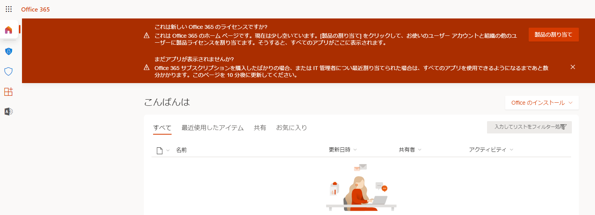
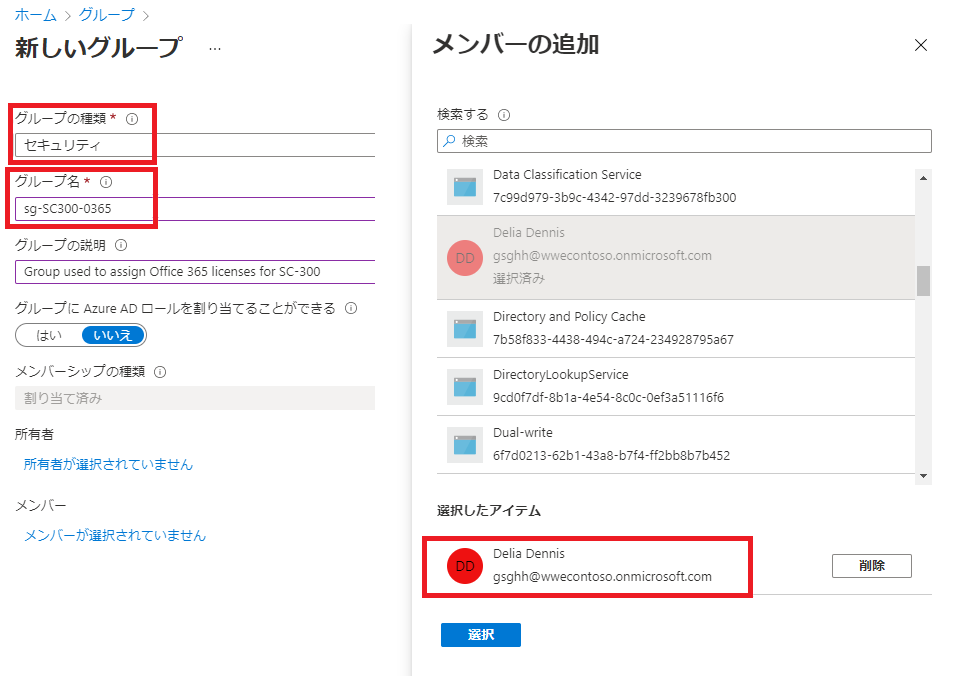
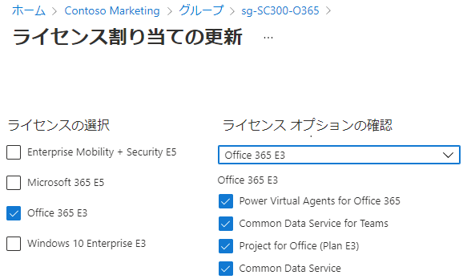
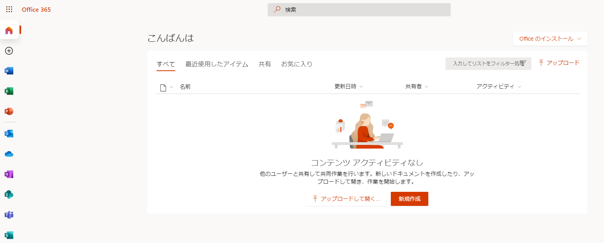

---
lab:
    title: '03 - グループ メンバーシップを使用してライセンスを割り当てる'
    learning path: '01'
    module: 'モジュール 02 - ID の作成、構成、管理を行う'
---

# ラボ 03: グループ メンバーシップを使用してライセンスを割り当てる

## ラボ シナリオ

あなたの組織は Azure AD のセキュリティ グループを使用してライセンスを管理することに決めました。新しいセキュリティ グループを設定し、そのグループにライセンスを割り当て、グループ メンバーのライセンスが更新されたことを確認する必要があります。

#### 推定時間: 10 分

## 演習 1 - セキュリティ グループを作成してユーザーを追加する

### タスク 1 - Delia Dennis が Office 365 にアクセスできるかどうかを確認する

1. ブラウザー ウィンドウを起動します。
2. [https://www.office.com](https://www.office.com) に接続します。
3. 「サイン イン」をクリックして、Delia Dennis として接続します。

    | **設定**| **値**|
    | :--- | :--- |
    | ユーザー名 | DeliaD@ <<自分の Azure ドメイン>>|
    | パスワード| 管理者と同じです|

4. Office.com の Web サイトに接続する必要がありますが、ライセンスがないことを示すメッセージが表示されます。

    
    
5. ブラウザー ウィンドウを閉じます。

### タスク2 - Azure Active Directory でセキュリティ グループを作成する

1. [https://portal.azure.com/#blade/Microsoft_AAD_IAM/ActiveDirectoryMenuBlade/Overview]( https://portal.azure.com/#blade/Microsoft_AAD_IAM/ActiveDirectoryMenuBlade/Overview) を参照します。

2. 左側のナビゲーション メニューの **「管理」** で、**「グループ」** を選択します。
3. 「グループ」ブレードのメニューで、**「新しいグループ」** を選択します。
4. 次の情報を使用して、グループを作成します。

    | **設定**| **値**|
    | :--- | :--- |
    | グループの種類| セキュリティ|
    | グループ名| sg-SC300-O365|
    | メンバーシップの種類| 割り当て済み|
    | 所有者| *自分の管理者アカウントをグループの所有者として割り当てる*|

5. 「メンバー」の下の「**メンバーを選択していません**」テキストをクリックします。
6. ユーザーの一覧から、**「Delia Dennis」** を選択します。
7. 「**選択**」ボタンをクリックします。

    

8. 「**作成**」ボタンをクリックします。
9. 完了したら、**sg-SC300-O365** という名前のグループが **「すべてのグループ」** リストに表示されていることを確認します。

## タスク3 - グループにライセンスを割り当てる

1. **「すべてのグループ」** リストで **sg-SC300-O365** を選択します。
2. 「Marketing」ブレードの **「管理」** で **「ライセンス」** を選択します。
3. メニューで **「+ 割り当て」** を選択します。
4. 「ライセンス割り当ての更新」ブレードの **「ライセンスの選択」** で、使用可能なライセンスのリストを確認し、**Office 365 E3** のチェック ボックスをオンにします。

    **ヒント** - 複数のライセンスが選択されている場合は、「ライセンスの確認」オプション メニューを使用して特定のライセンスを選択し、そのライセンスのライセンス オプションを表示できます。

    

6. **「保存」** を選択します。

### タスク 4 - Office 365 ライセンスを確認する

1. ブラウザー ウィンドウを起動します。
2. [https://www.office.com](https://www.office.com) に接続します。
3. 「サイン イン」をクリックして、Delia Dennis として接続します。

    | **設定**| **値**|
    | :--- | :--- |
    | ユーザー名 | DeliaD@ <<you azure domain>>|
    | パスワード| 管理者と同じです|

4. Office.com Web サイトに接続すると、ライセンスに関するメッセージは表示されません。左側にあるすべての Office アプリケーションを利用できます。

    
    
5. ブラウザー ウィンドウを閉じます。
    
