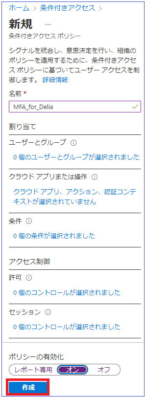
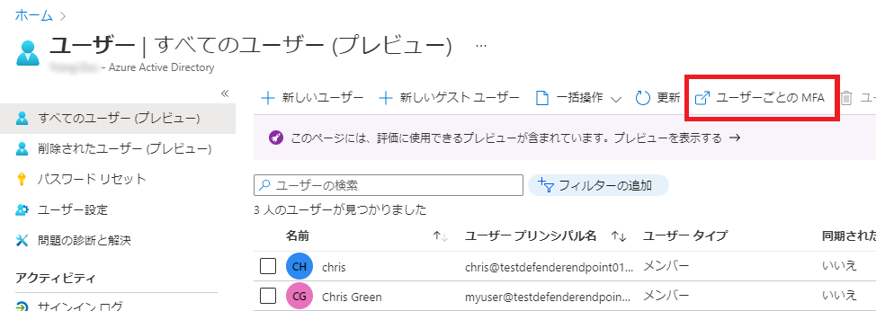
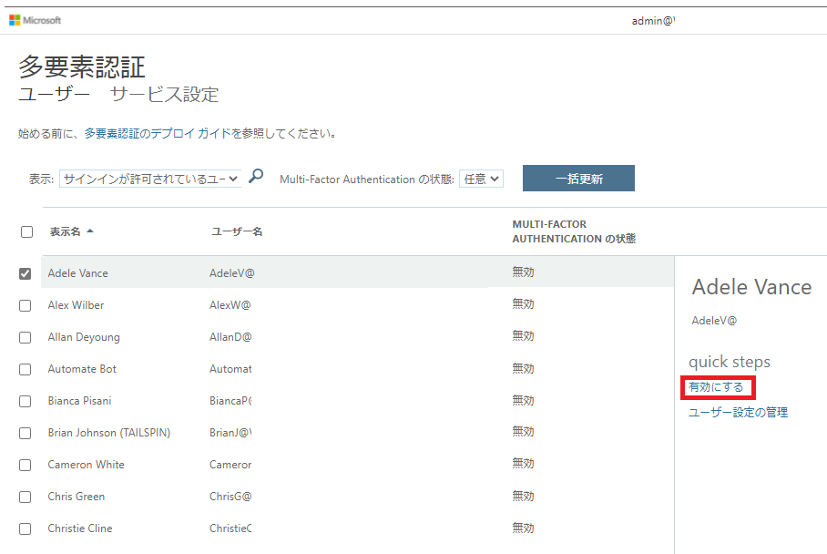

---
lab:
    title: '12 - Azure AD の Multi-Factor Authentication を有効にする'
    learning path: '02'
    module: 'モジュール 01 - Azure Multi-Factor Authentication の計画と管理を行う'
---

# ラボ 12 - Azure AD の Multi-Factor Authentication を有効にする

## ラボ シナリオ

組織のセキュリティを向上させるために、Azure Active Directory の多要素認証を有効にするよう指示されています。

#### 推定時間: 15 分

**重要** - この演習には Azure AD Premium ライセンスが必要です。

## 演習 1 - Azure で多要素認証を確認して有効にする

### タスク 1 - Azure Multi-Factor Authentication オプションを確認する

1. ディレクトリのグローバル管理者アカウントを使用して? [https://portal.azure.com](https://portal.azure.com) を参照し、サインインします。

2. 検索機能を使用して、**「multi-factor」** を検索します。

3. 検索結果で、「**Multi-Factor Authentication**」を選択します。

4. 「はじめに」ページの中央に表示されている **「構成」セクション** で、**「追加のクラウドベースの MFA 設定」** を選択します。

    

5. 新しいブラウザー ページには、Azure ユーザーの MFA オプションとサービス設定が表示されます。

    

    ここで、サポートされている認証方法を選択します。上の画面では、すべてが選択されています。

    ここでは "アプリ パスワード" の有効/無効を切り替えることもできます。これにより、多要素認証がサポートされないアプリに対して一意のパスワードを作成できます。この機能を使うと、ユーザーはそのアプリに固有のパスワードを利用し、Azure AD の ID で認証することができます。

### タスク 2 - Delia Dennis の MFA の条件付きアクセス ルールを設定する

次に、ネットワークにある特定のアプリにアクセスするゲスト ユーザーに MFA を強制する条件付きアクセス ポリシー ルールを設定する方法を確認してみましょう。

1. Azure portal に戻り、**「Azure Active Directory」** > **「セキュリティ」** > **「条件付きアクセス」** の順に選択します。

2. メニューで **「新しいポリシー」** を選択します。

    

3. ポリシーに名前を付けます。たとえば、**「MFA_for_Delia」** にします。

4. **「ユーザーとグループ」** を選択します。

    - **「ユーザーとグループの選択」** を選択します  
    - 構成する **「ユーザーとグループ」** のチェック ボックスを選択します。
    - **「0 人のユーザーとグループが選択されました」** 項目をクリックします。
    - ユーザーのリストから **「Delia Dennis」** を選択し、**「選択」** ボタンを選択します。

5. **「クラウド アプリまたは操作」** を選択します。

    - ドロップダウンで、**「クラウド アプリ」** が選択されていることを確認します。
    - 「含める」で、**「すべてのクラウド アプリ」** にマークを付けます。ロックアウトの可能性についてポップアップする警告に注意してください。 
    - 「含める」で、選択を **「アプリの選択」** 項目に変更します。
    - 新しく開いたダイアログで、**「Office365」** を選択します。
        - **リマインダー** - 以前のラボで、Delia Dennis に Office 365 ライセンスを付与し、ログインして動作することを確認しました。
    - **「選択」** を選択します。

6. 「条件」セクションを確認します。

    - **「場所」** を選択し、**「すべての場所」** に対して構成します。

7. **「アクセス制御」** で **「許可」** を選択し、**「アクセスを許可する」** が選択されていることを確認します。

8. **「多要素認証を要求する」** チェック ボックスをオンにして、MFA を適用します。

9. **「選択したコントロールすべてが必要」** が選択されていることを確認します。

10. **「選択」** を選択します。

11. **「ポリシーの有効化」** を **「オン」** に設定します。

12. **「作成」** をクリックし、ポリシーを作成します。

    

    これで、選択したユーザーとアプリケーションに対して MFA が有効になりました。次回、ゲストがそのアプリにサインインしようとすると、MFA の登録が求められます。

### タスク 3 - Delia のログインをテストする

1. 新しい InPrivate ブラウジング ウィンドウを開きます。
2. https://www.office.com に接続します。
3. 「Sign In」をクリックします。
4. **DeliaD@** `<<your domain address>>` を入力します。
5. パスワード = **管理者と同じです** を入力します。
6. **Authenticator アプリをセットアップして MFA に登録する必要があると** 旨を表すメッセージが表示されます。   **I want to set up a different method** をクリックすると、別の方法を選択することが可能です。好きな方法を選択して多要素認証のセットアップを完了してください。  注 - 続行する方法に関するいくつかのオプションを含むログイン失敗メッセージが表示される可能性があります。  この場合、**「再試行」** オプションをクリックします。

Delia 用に作成した条件付きアクセス ルールのため、Office 365 にアクセスするために MFA が必要になりました。

## 演習 2 - ログインに必要になるように MFA を構成する

### タスク 1 - Azure AD のユーザーごとの MFA を構成する

最後に、ユーザー アカウントに対して MFA を構成する方法を見ていきましょう。これは多要素認証設定にアクセスするもう 1 つの方法です。    
この方法を使用すると、条件付きアクセスを使用せずに、ユーザーごとに多要素認証を有効にすることができます（ライセンスは必要ありません）。    

1. Azure portal で Azure Active Directory ダッシュボードに戻ります。

2. **「ユーザー」** を選択します。

3. 「ユーザー」ウィンドウの一番上で、**「ユーザーごとの MFA」** を選択します。

    

4. 新しいブラウザーのタブ/ウィンドウが開き、多要素認証のユーザー設定ダイアログが表示されます。

    ユーザーを選択し、右側にあるクイック手順を利用することで、ユーザー ベースで MFA の有効/無効を切り替えることができます。

    

5. **「Adele Vance」** を選択します。
6. **quick steps** で **「有効にする」** オプションを選択します。
7. 通知ポップアップが表示されたらそれを読み、**「multi-factor auth を有効にする」** ボタンを選択します。
8. **「閉じる」** を選択します。
9. Adele の MFA ステータスが**有効**になっていることに注意してください。
10. **サービス設定**を選択して、ラボの前半で見た MFA 設定画面を表示できます。
11. 「MFA の設定」タブを閉じます。

### タスク 2 - Adele としてログインを試みる

1. MFA ログイン プロセスの別の例を見たい場合は、Adele にログインしてみてください。
