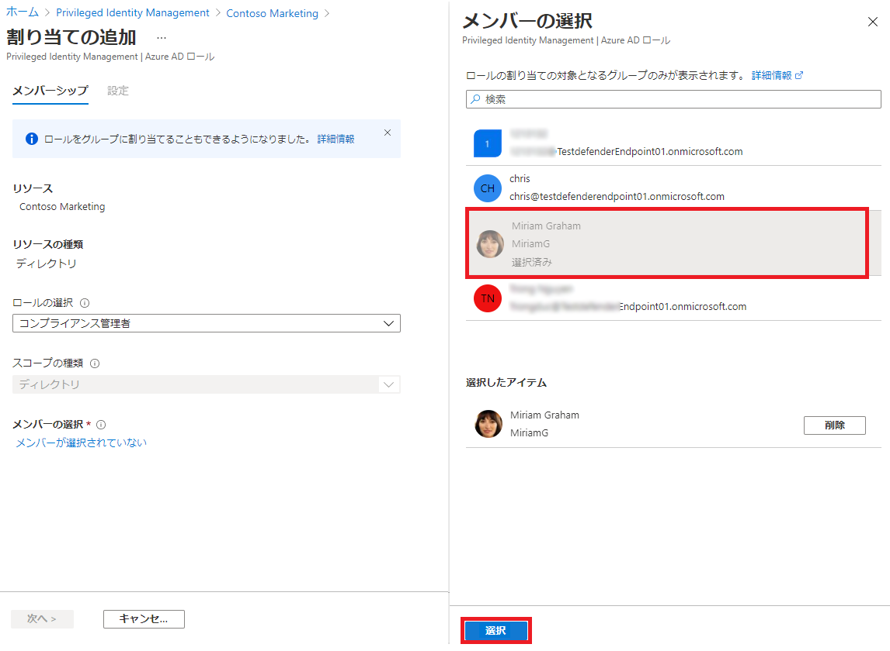
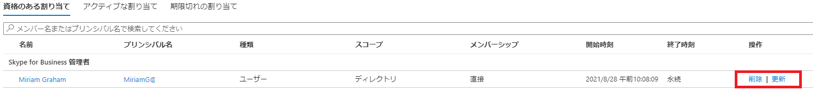

---
lab:
    title: '29 - Azure AD ロール用に Privileged Identity Management を構成する'
    learning path: '04'
    module: 'モジュール 03 - 特権アクセスの計画と実装を行う'
---

# ラボ 29: Privileged Identity Management で Azure AD ロールを割り当てる

## ラボ シナリオ

グローバル管理者は、Azure Active Directory (Azure AD) を使用して、永続的な Azure AD 管理者ロールの割り当てを行うことができます。こうしたロールの割り当ては、Azure portal または PowerShell のコマンド を使用して作成できます。

永続的な管理ロールの割り当ては、特権ロール管理者が Azure AD Privileged Identity Management (PIM) サービスを使用して行うこともできます。さらに、特権ロール管理者は、ユーザーを Azure AD 管理者ロールの候補にすることもできます。管理者候補は必要なときにロールをアクティブ化できます。作業が完了すると、そのアクセス許可は期限切れになります。

#### 推定時間: 15 分

## ロールの割り当て

ユーザーを Azure AD 管理者ロールの候補にするには、次の手順を実行します。

1. グローバル管理者アカウントを使用して、[https://portal.azure.com](https://portal.azure.com) にサインインします。

1. **「Azure AD Privileged Identity Management」** を検索してから選択します。

1. Privileged Identity Management ブレードの左側のナビゲーションで **「Azure AD ロール」** を選択します。

1. 「クイック スタート」ページの左側のナビゲーションで **「ロール」** を選択します。

1. 上部のメニューで **「+ 割り当ての追加」** を選択します。

    

1. 「割り当ての追加」ブレードの **「メンバーシップ」** タブで設定を確認します。

1. **「ロールの選択」** メニューを選択し、**「コンプライアンス管理者」** を選択します。

1. **「名前でロールを検索」**フィルターを使用すると、ロールを見つけやすくなります。

1. **「メンバーの選択」**で**「メンバーが選択されていません」**を選択します。

1. 「メンバーの選択」ウィンドウで、**Miriam Graham** を選択してから、**「選択」**を選択します。

    

1. 「割り当ての追加」ブレードで**「次へ」**を選択します。

1. **「設定」**タブの**「割り当ての種類」**で、使用可能なオプションを確認します。このタスクでは、既定の設定を使用します。

    - 有資格割り当ては、ロールを使用するためのアクションを実行することをロールのメンバーに要求します。要求されるアクションには、多要素認証 (MFA) チェックの実行、業務上の妥当性の指定、指定された承認者に対する承認要求などがあります。
    - アクティブ割り当ては、ロールを使用するために何らかのアクションを実行することをメンバーに要求しません。アクティブとして割り当てられたメンバーには常に、そのロールに割り当てられた特権があります。

1. 残りの設定を確認してから、**「割り当て」**を選択します。

## Miriam でログインする

1. InPrivate ブラウザー ウィンドウを開きます。
2. Azure portal (https://portal.azure.com) に接続します。
3. ユーザーがログインした状態で開いた場合は、右上隅にあるユーザーの名前をクリックして、**「別のアカウントとしてサインイン」**を選択します。
4. Miriam でログインします。

| フィールド | 値 |
| :--- | :--- |
| ユーザー名 | **MiriamG@** `<<your domain.onmicrosoft.com>>` |
| パスワード | pass@word123 |

5. **「Azure へようこそ」ダイアログ**を閉じます。
6. **「リソース、サービス、ドキュメントの検索」**バーから、Azure Active Directory を探し、ブレードを開きます。
7. **「概要」**ページで、**「自分のフィード」**を探します。
8. **Miriam Graham**の名前を選択します。 これにより、Miriam のプロフィール ページが開きます。
9. **「割り当てられたロール」**を選択してから、**「適格な割り当て」**を選択します。
10. Miriam が**コンプライアンス管理者**のロールを利用できるようになったことに注意してください。

## Azure AD ロールをアクティブにする

Azure AD ロールを想定する必要がある場合は、Privileged Identity Management で**「自分のロール」**を開いてアクティブ化を要求できます。

1. **「検索、リソース、サービス、ドキュメント」**バーから、特権を探します。
2. 「**Azure AD Privileged Identity Management**」ブレードを開きます。
3. 「Privileged Identity Management」ブレードの左側のナビゲーションで**「自分のロール」**を選択します。

1. 「自分のロール」ブレードで、資格のある割り当ての一覧を確認します。

    

1. 「コンプライアンス管理者ロール」行で**「アクティブ化」**を選択します。

1. 「アクティブ化 - コンプライアンス管理者」ウィンドウで**「追加の確認が必要」**を選択し、指示に従って追加のセキュリティ確認を行います。認証が要求されるのは、各セッションにつき 1 回だけです。

    

    **検証** - 現在のラボ環境構成に基づいて、MFA を構成し、正常にログインする必要があります。

1. 追加のセキュリティ確認を完了したら、「アクティブ化 - コンプライアンス管理者」ウィンドウの**「理由」**ボックスに、**「これはこのロールをアクティブ化する理由です」**と入力します。

    **重要な注意** - 最小特権の原則として、アカウントは必要な期間だけアクティブ化する必要があります。  作業を行う必要がある場合は、1.5 時間しかかからないので、期間を 2 時間に設定します。  同様に、午後 3 時以降まで作業を行うことができないことがわかっている場合は、カスタム アクティベーション時間を選択します。

1. **「アクティブ化」**を選択します。

## 制限スコープがあるロールを割り当てる

特定のロールでは、付与されるアクセス許可の範囲を 1 つの管理単位、サービス プリンシパル、またはアプリケーションに制限することができます。この手順は、管理単位のスコープを持つロールを割り当てる場合の例です。

1. MiriamG のブラウザー ウィンドウを閉じてから、管理者アカウントとして Azure portal を開くことを忘れないでください。
2. 「Privileged Identity Management」ブレードに移動し、左側のナビゲーション メニューで**「Azure AD ロール」**を選択します。
3. 「**ロール**」を選択します。
4. 「ロール」ブレードの上部のメニューで **「+ 割り当ての追加」** を選択します。

5. 「割り当ての追加」ブレードで**「ロールの選択」**メニューを選択し、**「ユーザー管理者」** を選択します。

1. **「スコープの種類」** メニューを選択し、使用可能なオプションを確認します。ここでは、**「ディレクトリ」** というスコープの種類を使用します。

>[!ヒント]
>管理単位のスコープの種類の詳細については、[https://docs.microsoft.com/ja-jp/azure/active-directory/roles/administrative-units](https://docs.microsoft.com/en-us/azure/active-directory/roles/admin-units-manage) を参照してください。

1. 制限されたスコープを使用せずにロールを割り当てたときと同様に、メンバーを追加し、設定オプションを完了します。ここでは、**「キャンセル」**を選択します。

## 既存のロールの割り当てを更新または削除する

既存のロールの割り当てを更新または削除するには、次の手順を実行します。

1. 「Privileged Identity Management を開く」 > 「Azure AD ロール」ブレードの左側のナビゲーションで**「割り当て」**を選択します。

1. **「割り当て」** リストで、「コンプライアンス管理者」の **「操作」** 列のオプションを確認します。

    

1. **「更新」** を選択し、「メンバーシップの設定」ウィンドウで使用可能なオプションを確認します。完了したら、ウィンドウを閉じます。

1. **「削除」** を選択します。

1. **「削除」**ダイアログ ボックスで情報を確認し、**「はい」** を選択します。
